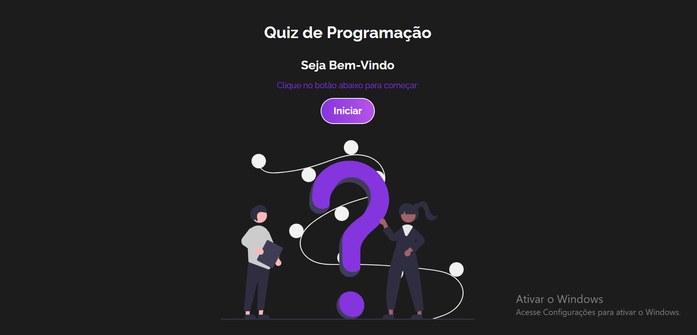
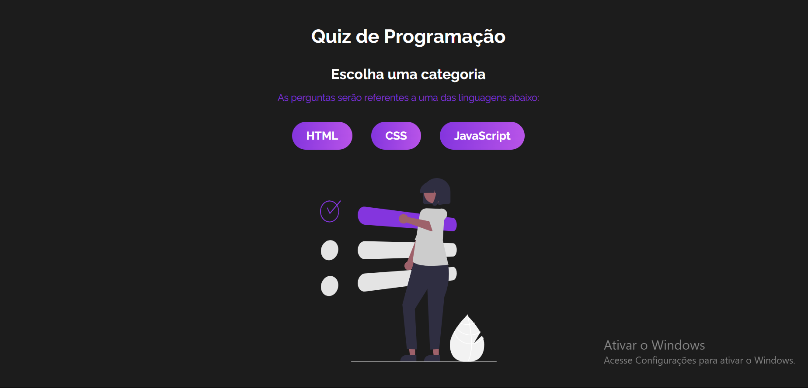
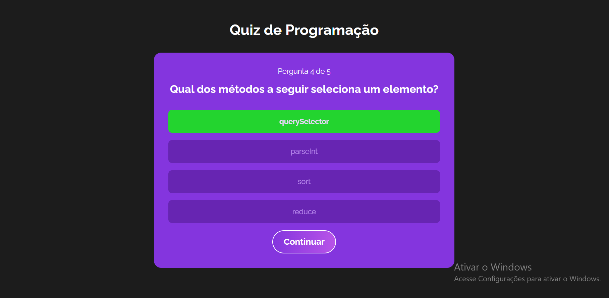
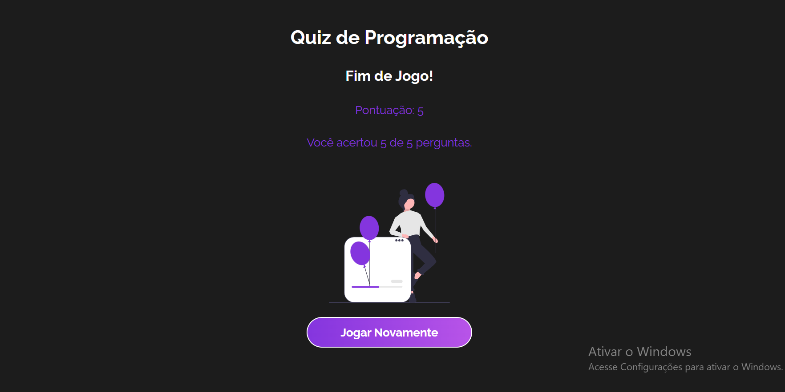

# Quiz de programação

<h1> Aplicação Web Responsiva</h1>

```js
Este projeto é uma aplicação web de perguntas e respostas desenvolvida como Quiz de programação.
O assunto de ínicio para a plataforma foi um Quiz sobre programação, porém é possível 
ultilizar-la com outros assuntos nas perguntas.
Com um design bem atual e organizado, passa ao usuário uma ótima experiência de responder ao Quiz de perguntas.
```

<h2>Autor: Pedro Cezar Alves da Silva Beserra. <h2>

<h2>Linguagens que foram utilizadas:<h2>
- HTML
- CSS
- Javascript
- Framework React.js

# Link
Acesse o Link do meu projeto, use a plataforma e tenha uma experiência única:

Link do meu site 💻: https://projeto-quiz-react-chi.vercel.app/

# Screenshot
Aqui temos a captura de tela do projeto:







